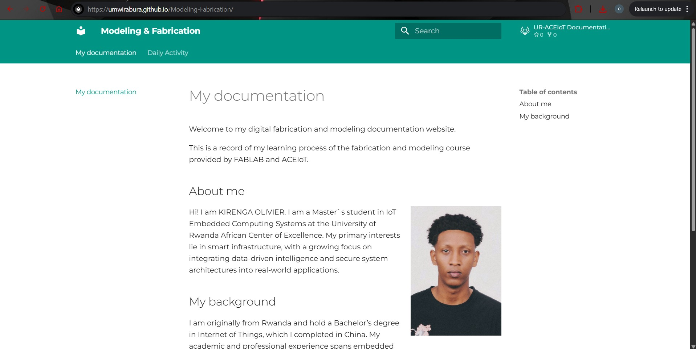

# 1. Activity of Day 1

## Foundations of Modeling & Fabrication

Modeling and fabrication form the backbone of the digital design process. They connect abstract ideas, computational thinking, material behavior, and real-world production into a single workflow.

Design is not only about creating shapes digitally; it requires understanding how those ideas will be translated into physical objects. Because of this, fabrication constraints strongly influence design decisions from the very beginning.

---

### Modeling

**Modeling** goes beyond drawing objects on a screen.  
It represents form, structure, logic, behavior, and sometimes even intelligence.

Several modeling approaches are commonly used in digital fabrication:

- **Geometric Modeling**  
  This approach focuses on defining shapes using basic geometric elements such as points, lines, surfaces, and solids. It allows precise control over form and dimensions.

- **Parametric and Rule-Based Modeling**  
  In this method, designs are created using parameters, constraints, and relationships. Changing one dimension or rule automatically updates the entire model, making designs flexible and adaptable.

- **Simulation and Data-Driven Modeling**  
  This approach uses data and simulations to predict how a design will behave under real-world conditions, such as stress, temperature, or material deformation.

---

### Fabrication

**Fabrication** is the process of transforming digital models into physical artifacts.

It requires an understanding of:

- **Materials** – how they behave, deform, and respond to fabrication techniques  
- **Machines** – such as 3D printers, laser cutters, and CNC machines  
- **Processes** – the steps and methods used to shape and assemble materials  

---

#### Design-to-Fabrication Process

Design is an **iterative process**, not a linear one. Feedback at every stage helps improve the final outcome. The typical workflow includes:

- **Idea** – Defining the concept, goals, and constraints  
- **Model** – Creating a digital representation of the idea  
- **Prototype** – Producing an early version for testing  
- **Fabricate** – Manufacturing the final physical object  
- **Evaluate** – Testing, analyzing results, and refining the design  

---

## Activity 1 – Building a Documentation Website with MkDocs Material

Documentation is a critical part of digital fabrication. It allows designers to record processes, decisions, failures, and lessons learned.

### About the Website

For this activity, I created a **documentation website using MkDocs Material** to record my learning journey in modeling and fabrication.

The website documents:
- Course understanding  
- Daily activities and tasks  
- Tools and materials used  
- Reflections, challenges, and outcomes  

The goal is to create a clear, reproducible record of my work throughout the course.

### Website Pages

- **Home** – Introduces me, the course, and the purpose of the documentation  

- **Daily Activities** – Records my understanding of course content and the activities completed during each session  

---

## Activity 2 – Publishing Documentation via GitHub Pages

### From Local Project to Public Knowledge

In this activity, I learned how to publish a technical documentation website using **GitHub and GitHub Pages**. This process made it possible to share my locally created documentation as a live website accessible to anyone online.

### Task Description

The task involved uploading the MkDocs project to GitHub and deploying it as a public website using GitHub Pages.

#### Uploading the Local Documentation to GitHub

- Created a GitHub repository to host the documentation project  
- Uploaded the MkDocs project files using **Git Bash**, ensuring all files were properly tracked and version-controlled  

#### Deploying the Website

- Enabled **GitHub Pages** in the repository settings  
- Deployed the documentation site to a public URL, allowing it to be viewed without direct access to the repository  

This process helped me understand how documentation can be shared openly and maintained using version control tools.

Below is my documentation`s home page.
{ width=600 height= 800 }

---

## Activity 3 – Peer Review

For this activity, I reviewed a peer’s documentation website.

The documentation demonstrated a **clear understanding of the modeling and fabrication concepts** covered in the course. The workflow was logical, well-structured, and easy to follow, making it accessible even to someone new to digital fabrication.

All required exercises were completed and documented clearly, with good explanations of the design process and outcomes. Collaboration during lab sessions also helped reinforce concepts and encouraged knowledge sharing.

Overall, the documentation reflected **strong design thinking, clarity, and technical understanding**, serving as a solid example of effective course documentation.
