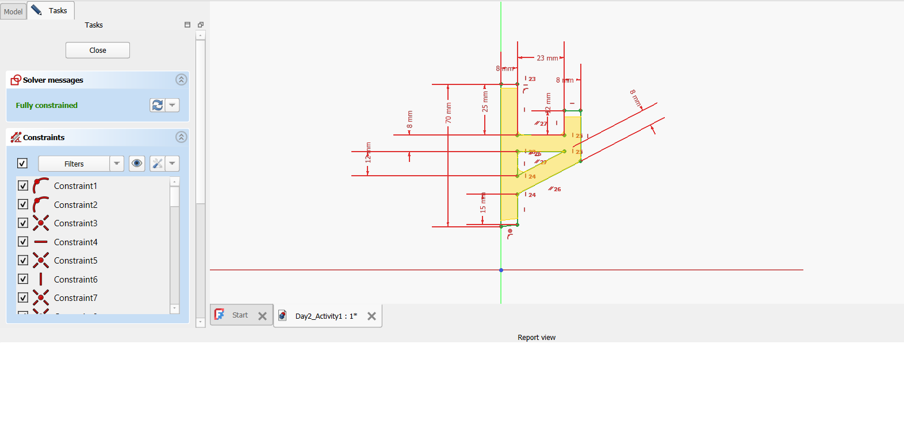
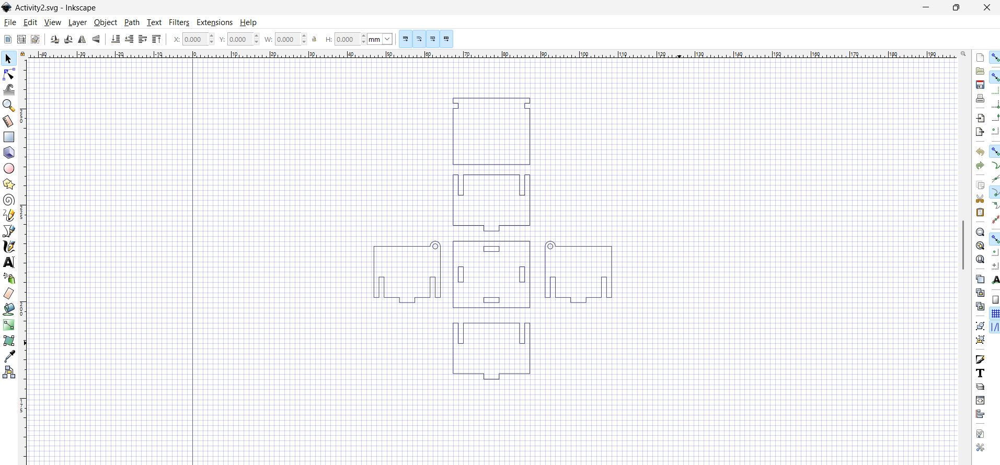

# 2. Activity of Day 2

## Parametric & Rule-Based Modeling

On Day 2, we explored **parametric and rule-based modeling**, understanding how modeling becomes more powerful when design logic, constraints, and relationships define geometry — not just manual drawing.

Parametric modeling allows a design to become **responsive** to change. When we define relationships and constraints, a single adjustment triggers automated updates across the whole model. This makes designs more flexible and efficient — a valuable skill in digital fabrication.

---

## Tools and Methods

For this activity, I worked with a parametric modeling tool to understand how geometry evolves through changes in parameters and rules.

Specifically, I explored:

- **Constraint-based modeling techniques**
- **Parameter linking and dimensional control**
- **Design updates triggered by changing input values**

This approach helped me appreciate how parametric relationships replace trial-and-error workflows.

---

## Process Documentation

### 1. Setting up the modeling environment

I opened my FreeCAD platform and:

- Created a new sketch
- Defined basic geometric elements (lines, circles)
- Added constraints such as symmetry, angles, and parallelism

These constraints helped lock design intent into the model.

### 2. Establishing parameters

After sketching, I defined parameters for:

- Outer dimensions (length, width, height)
- Feature controls (hole diameter, spacing)
- Constraint relationships (angles, equal lengths)

This structure ensured that changing one dimension automatically updated the entire model.

---

## Screenshots and Visual Results

Below are images that show the progression of my modeling workflow.

### Modeling Workspace

{ width=700 }

### Parametric Result After Rule Update

{ width=700 }

---

## Reflections & Insights

Through this activity, I learned:

- Parametric modeling drastically improves design iteration.
- Constraints give meaning to design intent and logic.
- Design changes propagate automatically with well-defined rules.

This perspective challenges the traditional workflow of manually redrawing features. Parametric control provides speed, repeatability, and precision — all important in digital fabrication.

---

## Files & Outputs

[Download activity 1 of day 1](../files/Activity1.FCStd){: .md-button }

- Screenshots:  
  Located in `docs/images/day_2/`

## Activity 2 – Inkscape Model

### Press-Fit Box Panel (2D Vector)

The second activity focused on creating a 2D press-fit box panel using Inkscape, a vector graphics editor. The goal was to design flat panels with interlocking tabs and slots that could be laser-cut and assembled without fasteners or adhesives. This type of design is commonly used in digital fabrication for creating boxes, enclosures, and modular structures.

The design process began by creating rectangular shapes to represent the box panels. Tabs were drawn and positioned along the edges of these panels, which would later interlock with slots on adjacent panels. Using Inkscape's Union tool (Path → Union), the base panels and tabs were merged into single, unified objects. This step was essential for creating clean geometry suitable for fabrication.

Next, rectangular slots were created by drawing shapes at the appropriate positions and using the Difference tool (Path → Difference) to cut them out of the panels. The slot widths needed to match the material thickness to ensure a tight press-fit assembly. Careful attention was paid to the alignment and positioning of both tabs and slots to ensure the panels would fit together properly. Inkscape's alignment and snapping features were particularly useful for maintaining precision throughout the design.

One of the main challenges encountered was achieving the correct tolerance for the press-fit joints. Slots that are too tight won't allow assembly, while slots that are too loose result in unstable connections. Understanding how material thickness affects the design and accounting for the laser cutter's kerf (the width of material removed by the laser beam) were important considerations. The final design demonstrates how 2D vector graphics can be directly translated into functional fabricated objects.

This activity reinforced the importance of precision in 2D design for fabrication and highlighted the relationship between digital modeling and physical manufacturing constraints. The workflow demonstrated how vector-based design serves as a bridge between concept and production-ready files.

### Download Files

[Download Panel (.svg)](../files/Activity2.svg)