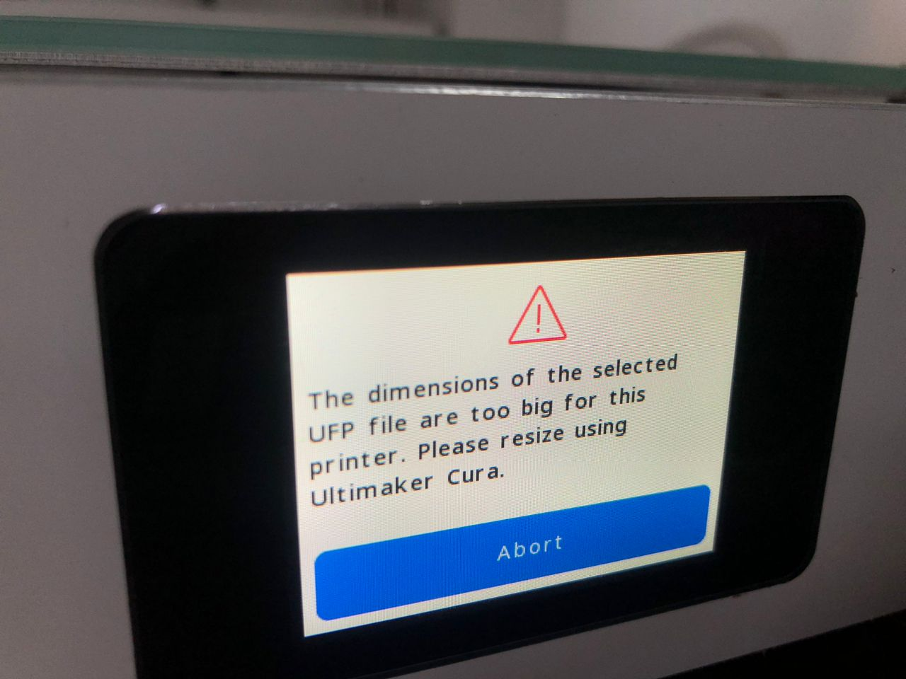

## Day 6 – Digital Fabrication II: Additive Manufacturing

### 3D Printing a Container Lid

Day 6 focused on additive manufacturing through 3D printing technology. The objective was to gain hands-on experience with the complete 3D printing workflow, from selecting and preparing a digital model to operating the printer and post-processing the finished part. This activity demonstrated how digital design translates into physical objects through layer-by-layer material deposition.

The chosen design was a container lid sourced from Printables.com, an online repository of 3D printable models. Using pre-existing designs from such platforms is common practice in the maker community and provides an opportunity to study well-engineered models while learning the fabrication process. The lid design featured functional geometry including threading or fitting mechanisms that would need to interface with the base container component, making it a practical test of print accuracy and dimensional precision.

The workflow began with downloading the STL file and importing it into slicing software. Slicing is the critical step where a 3D model is converted into machine instructions (G-code) that tell the printer exactly how to build each layer. During this process, several parameters needed to be configured including layer height, infill density, print speed, and support structures. The orientation of the part on the build plate was also considered, as this affects both the structural integrity of the final print and the amount of support material required.

One significant challenge encountered during this process was selecting the correct printer profile in the slicing software. Initially, the wrong printer type was configured, which caused an error when attempting to send the print job to the machine. This error highlighted the importance of verifying machine settings before starting a print, as different printers have varying build volumes, nozzle configurations, and firmware requirements. The error was resolved by reconfiguring the slicer with the correct printer model and re-generating the G-code.

After resolving the configuration issue, the corrected G-code was loaded onto the printer. The machine was prepared by ensuring the build plate was level and clean, and that the filament was properly loaded and feeding smoothly. The print began with a first layer that required careful monitoring to ensure proper adhesion to the build plate, as first layer issues are a common cause of print failures. Once the first few layers were successfully deposited, the print continued with minimal intervention.

The printing process itself took several hours, depending on the size and complexity of the lid design and the chosen layer height. Finer layers produce smoother surfaces but take longer to print, while thicker layers print faster but may show more visible layer lines. Throughout the print, the machine deposited material layer by layer, gradually building up the three-dimensional form from the bottom up. Support structures, if any were needed, were generated in areas where the geometry would otherwise print in mid-air.

After the print completed, the part was removed from the build plate. Post-processing involved removing any support material and cleaning up the surface. Depending on the print quality and intended use, additional finishing steps such as sanding, filing, or chemical smoothing could be applied, though these were not strictly necessary for a functional prototype. The dimensional accuracy was checked to ensure the lid would fit properly with its corresponding container base.

This activity demonstrated several key concepts in additive manufacturing. Understanding how slicer settings affect both print quality and print time is essential for efficient 3D printing. The importance of proper machine configuration and error troubleshooting was reinforced through the printer selection issue. Additionally, working with a functional design that has specific dimensional requirements highlighted how 3D printing tolerances and material shrinkage must be considered during the digital preparation phase.

The experience also illustrated the difference between designing for additive manufacturing versus other fabrication methods. Unlike subtractive processes that remove material, additive manufacturing builds objects layer by layer, which introduces unique constraints such as the need for support structures, consideration of overhang angles, and awareness of how layer orientation affects strength. These design-for-manufacturing principles are critical when creating original designs rather than printing existing models.

### Reflection

The 3D printing process revealed the importance of attention to detail in both digital preparation and machine setup. Small configuration errors can prevent successful printing, emphasizing the need for systematic verification of settings before starting a job. Working with a functional part design provided practical insight into how dimensional accuracy and material properties affect the usability of printed objects. This hands-on experience with additive manufacturing complements the subtractive methods explored in previous days, demonstrating the unique capabilities and constraints of building objects layer by layer.