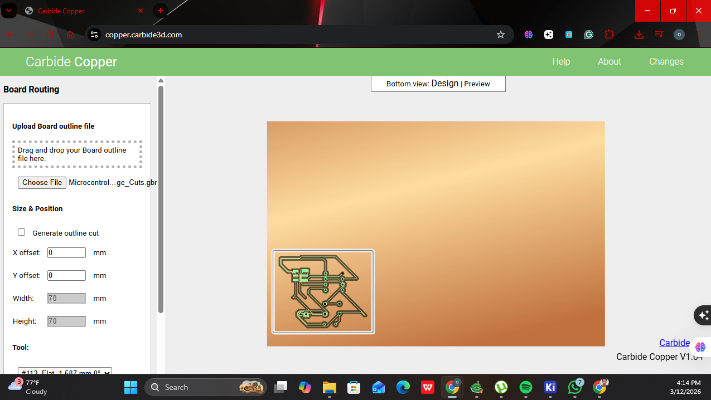
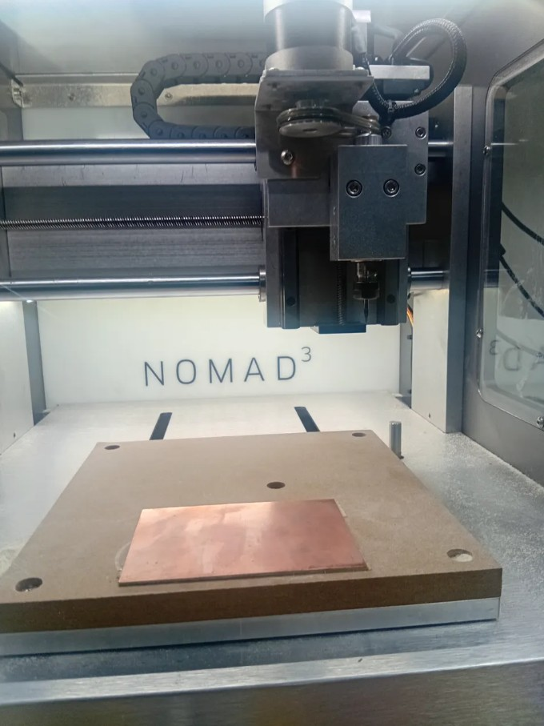
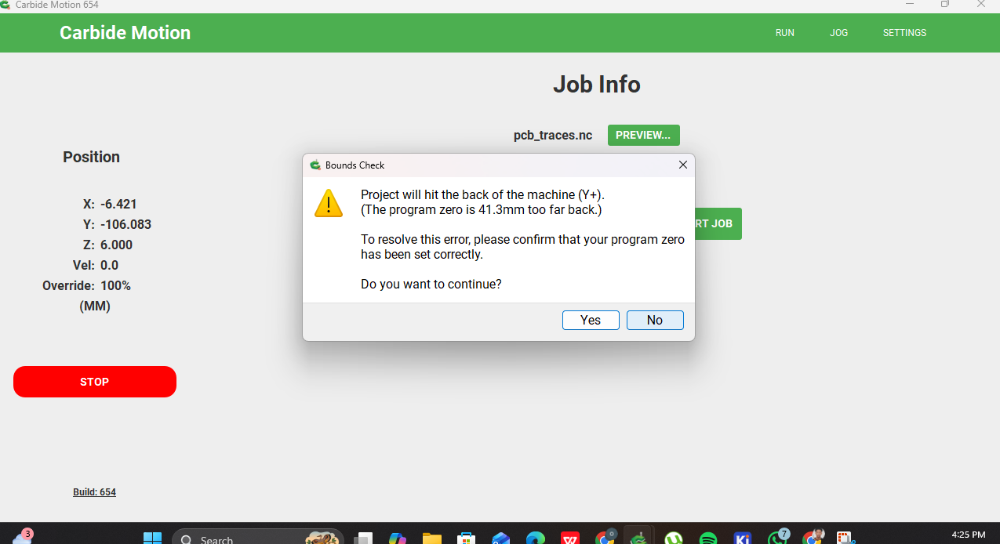
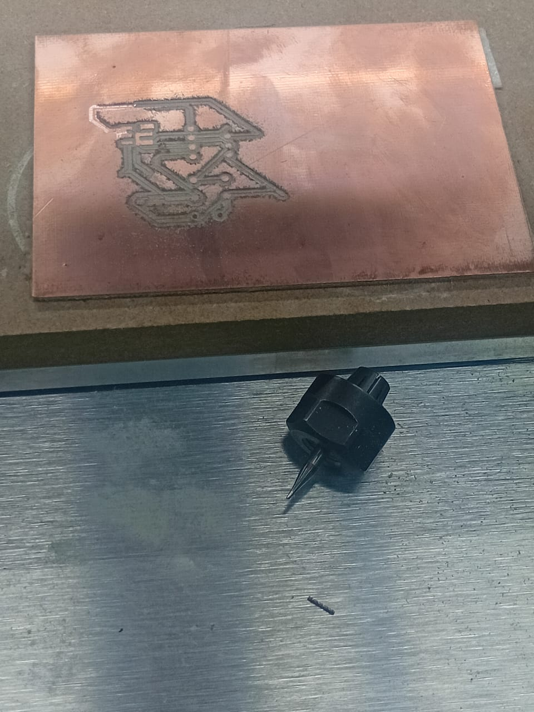

## Day 7 – Digital Fabrication III: PCB Milling

### Fabricating the ATtiny45 Board on the Nomad 3

Day 7 focused on the physical fabrication of the PCB designed during Day 3, using the Nomad 3 desktop CNC milling machine. This activity represented the transition from digital design to physical production, completing the workflow that began in KiCad by producing a tangible copper circuit board. The process required working through two software tools — Carbide Copper for toolpath generation and Carbide Motion for machine control — and provided hands-on experience with the challenges that arise when taking a digital design into a physical manufacturing environment.

---

### Preparing the G-Code with Carbide Copper

The first step was getting the Gerber files from KiCad into a format the Nomad 3 could actually use. Carbide Copper, a web-based tool at copper.carbide3d.com, handles exactly that — it takes the board design files and converts them into the movement instructions the machine follows during milling.

The setup process involved entering the board dimensions to match the physical copper-clad sheet, setting the job to bottom side only since the ATtiny45 design is single-sided, and uploading three files from the KiCad project in a specific order. The first was `Microcontroller PCB Design-F_Cu.gbr`, the front copper layer file, which contains all the trace and pad geometry — essentially the circuit itself. The second was `Microcontroller PCB Design-PTH.drl`, the drill file for plated through-holes, which tells the software where component lead holes need to be made. The third was `Microcontroller PCB Design-Edge_Cuts.gbr`, the board outline file, which defines the physical boundary of the PCB so the machine knows where the board ends. Each file handles a different aspect of the board, and Carbide Copper uses all three together to build a complete picture of what needs to be milled. After selecting the appropriate engraving tool and confirming the settings, it generated the G-code file ready to be loaded into the machine.

---

### Machine Setup and Job Initialization

With the G-code ready, the copper-clad board was secured to the Nomad 3 bed using double-sided tape to prevent any movement during milling. Proper fixation is critical in PCB milling, as even minor shifts in the board during the process result in misaligned traces that render the board unusable. The G-code file was then loaded into Carbide Motion, the machine control software, and the program zero was set to define the reference point for all subsequent cuts.

Before the job could start, Carbide Motion flagged a bounds check warning indicating that the program zero had been positioned 41.3 mm too far toward the back of the machine along the Y axis. This meant the machine would attempt to travel beyond its physical working limits during the job. The warning required stopping, resetting the program zero to a corrected position closer to the front of the machine bed, and restarting the job initialization process.

This step highlighted how important accurate zero-setting is in CNC workflows. A small error in the reference point propagates through every toolpath the machine executes, affecting not just position accuracy but also the mechanical load placed on the cutting tool.

---

### Milling Process and Bit Failure

With the corrected program zero confirmed, the Nomad 3 began the trace isolation passes, removing copper from the areas between circuit traces to define the conductive paths of the ATtiny45 board. The machine followed the programmed toolpaths, and the milling process was progressing as expected when the engraving bit broke mid-operation.

PCB engraving bits are extremely fine-tipped tools that are highly sensitive to cutting depth. A likely contributing factor to the failure was the earlier zero-setting issue: even after correction, if the Z-axis depth was slightly off, the bit would have been cutting more aggressively into the substrate material beneath the copper layer rather than skimming the surface. This type of overload causes the tool tip to snap. The break halted the job before the full board outline could be completed, leaving a partially milled PCB.

The partial result nonetheless showed that the trace geometry from the Day 3 KiCad design had translated correctly into the milling toolpaths. The circuit traces, component pads, and the ATtiny45 footprint are clearly visible on the copper surface where the machine completed its passes before the failure occurred.

---

### Reflection

This session made clear that the transition from digital design to physical fabrication introduces a layer of complexity that cannot be fully anticipated from the design environment alone. The bounds check error and the subsequent bit failure were connected: an imprecise zero-setting creates downstream conditions that affect tool loading and longevity. The experience reinforced the importance of systematic setup verification before running any CNC job — particularly the program zero, depth of cut, and job preview — as these settings directly determine whether the physical outcome matches the digital intent. Repeating this activity with corrected setup parameters would likely produce a complete, functional board from the Day 3 design.
